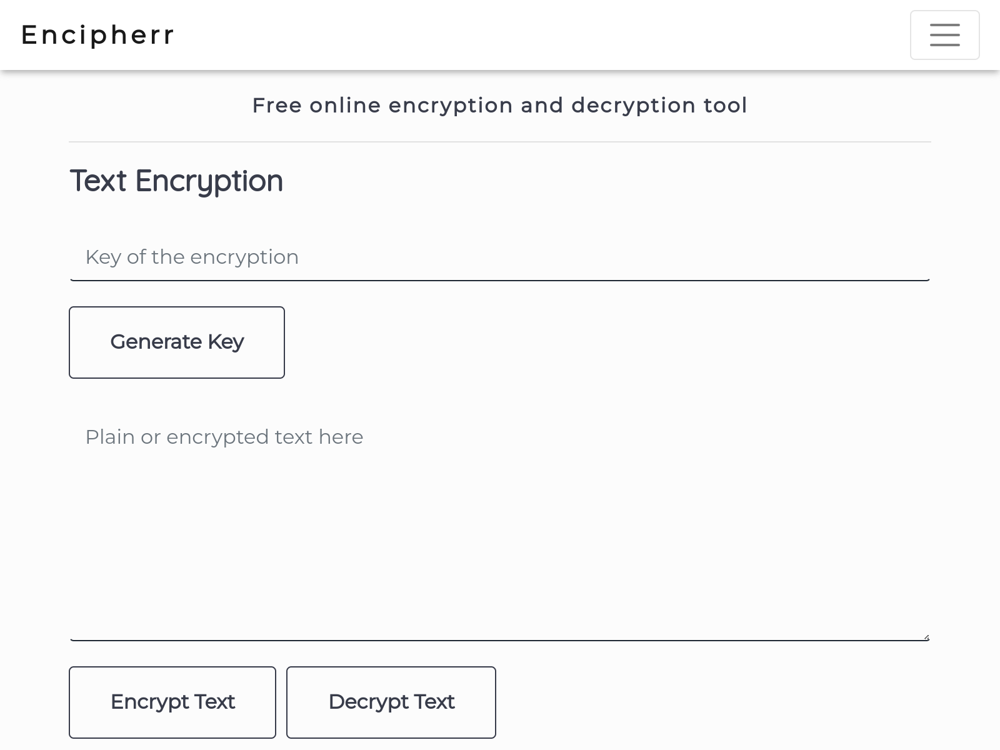

<p align="center">
  <a href="https://encipherr.pythonanywhere.com/">
    
  </a>
  <h3 align="center">Encipherr</h3>

 
  <p align="center">
    Free online encryption and decryption tool.
    <br>
    <a href="https://encipherr.pythonanywhere.com/"><strong>encipherr »</strong></a>
  </p>
</p>

<!-- Improved compatibility of back to top link: See: https://github.com/othneildrew/Best-README-Template/pull/73 -->
<a name="readme-top"></a>
<!--
*** Thanks for checking out the Best-README-Template. If you have a suggestion
*** that would make this better, please fork the repo and create a pull request
*** or simply open an issue with the tag "enhancement".
*** Don't forget to give the project a star!
*** Thanks again! Now go create something AMAZING! :D
-->


<!-- PROJECT SHIELDS -->
<!--
*** I'm using markdown "reference style" links for readability.
*** Reference links are enclosed in brackets [ ] instead of parentheses ( ).
*** See the bottom of this document for the declaration of the reference variables
*** for contributors-url, forks-url, etc. This is an optional, concise syntax you may use.
*** https://www.markdownguide.org/basic-syntax/#reference-style-links
-->
[![Contributors][contributors-shield]][contributors-url]
[![Forks][forks-shield]][forks-url]
[![Stargazers][stars-shield]][stars-url]
[![Issues][issues-shield]][issues-url]
[![MIT License][license-shield]][license-url]
[![LinkedIn][linkedin-shield]][linkedin-url]

### Made with love using:
     
## About The Project

[](https://encipherr.pythonanywhere.com/)

Encipherr is a web application developed with <a href="https://flask.palletsprojects.com/en/2.0.x/" target="_blank">Flask</a> & 
<a href="https://getbootstrap.com" target="_blank">Bootstrap Framework</a>.It offers a free powerful encryption of texts and files using <a href="https://fr.wikipedia.org/wiki/Advanced_Encryption_Standard" target="_blank">AES</a> encryption algorithm.Try it now.
## Usage
Visit <a href="https://Encipherr.pythonanywhere.com/" target="_blank">Encipherr website</a> \
or install project files and run it locally:

```bash
git clone https://github.com/Oussama1403/Encipherr

```
The project directory will contain:
```

├── CHANGELOG.md
├── db.sqlite3
├── flask_app.py
├── README.md
├── static
│   ├── css
│   │   └── style.css
│   ├── js
│   │   ├── ajaxcall.js
│   │   └── upload.js
│   ├── logo.png
│   └── pwa
│       ├── 512x512-blue.png
│       ├── 512x512.png
│       ├── app.js
│       ├── manifest.json
│       └── offline.html
├── sw.js
└── templates
    ├── about.html
    ├── base.html
    ├── home.html
    └── privacy.html

```

:warning: Make sure python3 and flask framework are installed.

install modules:
```bash
pip install -r requirements.txt
```
then run the server by typing in your terminal:

```python
python3 flask_app.py
```
## CHANGELOG
Read the latest notable changes made to a Encipherr.[here](CHANGELOG.md)

## Contributing
Pull requests are welcome. For major changes, please open an issue first to discuss what you would like to change.

Please make sure to test your changes.

## License
[MIT](https://choosealicense.com/licenses/mit/)
